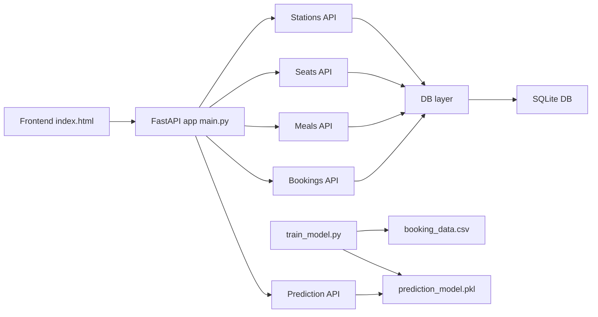

## Bus Booking System – Architecture & Flow

This document explains **how the whole project fits together** – backend, frontend, database, and ML – so you can understand and reason about the system end‑to‑end.

---

## 1. High‑Level System Overview

- **Domain**: Sleeper bus booking for a single fixed route  
  Ahmedabad → Vadodara → Surat → Vapi → Mumbai
- **Main capabilities**:
  - Search by **date + route segment**
  - **Seat selection** on a sleeper layout
  - **Optional meal booking** per seat
  - **Booking confirmation prediction** (ML)
  - **Booking management** (view + cancel by booking ID)

### Tech Stack (by layer)

- **Frontend**: `frontend/index.html`
  - Pure HTML/CSS/JavaScript (no framework)
  - Single‑page, multi‑step wizard
  - Talks to backend via `fetch` (`/api/*` endpoints)

- **Backend**: FastAPI (`backend/`)
  - `main.py` – app factory, startup, route registration
  - `routes/*.py` – REST APIs by domain
  - `schemas.py` – Pydantic models (request/response)
  - `models.py` – SQLAlchemy models (database tables)
  - `database.py` – SQLite engine + session management

- **ML / Data**:
  - `data/booking_data.csv` – synthetic training data
  - `backend/train_model.py` – training pipeline
  - `models/prediction_model.pkl` – trained Logistic Regression + scaler
  - `backend/routes/predict.py` – prediction API

### 1.1 High‑Level Architecture Diagram

---

## 2. Backend Architecture

### 2.1 Entry Point & App Lifecycle (`backend/main.py`)

- **`create_app()`**:
  - Creates `FastAPI` instance with title/description/version.
  - Adds **CORS** so the browser frontend can call the API.
  - Calls `Base.metadata.create_all(bind=engine)` to create DB tables.
  - Calls `seed_initial_data()` to insert:
    - 5 route stations (Ahmedabad → Mumbai)
    - 20 seats (10 lower, 10 upper; left/right; priced)
    - 3 meals (breakfast, lunch, dinner)
  - Pre‑loads the ML model by importing `get_model()` from `routes.predict`.
  - Registers routers:
    - `/api/stations` – stations
    - `/api/seats` – seats + availability
    - `/api/meals` – meal catalog
    - `/api/bookings` – booking CRUD
    - `/api/predict` – ML prediction

- **`app = create_app()`**:
  - Global FastAPI app used by Uvicorn.
  - Automatically exposes **Swagger UI** at `/docs` from route + schema metadata.

### 2.2 Database Layer (`backend/database.py` + `backend/models.py`)

- **Database configuration**:
  - SQLite file via SQLAlchemy engine.
  - `SessionLocal` = session factory.
  - `get_db()` dependency for routes (opens DB session per request).

- **Core tables** (`backend/models.py`):
  - `Station`
    - `id`, `name`, `order_index`
    - Defines the fixed route and station ordering.
  - `Seat`
    - `id`, `seat_number` (`L1`–`L10`, `U1`–`U10`), `deck` (`lower`/`upper`), `position` (`left`/`right`), `price`.
  - `Meal`
    - `id`, `name`, `meal_type` (`breakfast`/`lunch`/`dinner`), `price`.
  - `Booking`
    - `id` (DB), `booking_id` (public, e.g. `BK7X3M9K`)
    - Passenger info, `travel_date`, `boarding_station_id`, `dropping_station_id`
    - `total_amount`, `status` (`confirmed`/`cancelled`), `created_at`
    - Relationships: `seats` (`BookingSeat`), `meals` (`BookingMeal`).
  - `BookingSeat`
    - Join table: **booking ↔ seats** (many‑to‑many).
  - `BookingMeal`
    - Join table: **booking ↔ meals ↔ seats** (meal per passenger/seat).

> **Mental model**:  
> - `Booking` = one transaction  
> - `BookingSeat` = which seats are reserved  
> - `BookingMeal` = what each passenger will eat  
> - Availability comes from **reading bookings for a date**, not from a separate “availability” table.

### 2.3 API Layer (`backend/routes/*.py` + `backend/schemas.py`)

#### Schemas (`backend/schemas.py`)

- Separate Pydantic models for:
  - **Read models**: `StationResponse`, `SeatResponse`, `MealResponse`, `BookingResponse`, `PredictionResponse`
  - **Write models**: `BookingCreate`, `MealSelection`, `PredictionRequest`
- These define the **shape of JSON** that the frontend sends/receives and are what appear in Swagger.

#### Stations API (`routes/stations.py`)

- `GET /api/stations`
  - Reads all `Station` rows ordered by `order_index`.
  - Used by the frontend to populate boarding/dropping dropdowns.

#### Seats API (`routes/seats.py`)

- `GET /api/seats?travel_date=YYYY-MM-DD`
  - Validates date (format + not in the past).
  - Queries all `Seat` rows.
  - Finds **booked seat IDs** for that date:
    - Joins `BookingSeat` → `Booking` where `travel_date` matches and `status='confirmed'`.
  - Returns every seat as `SeatResponse` with:
    - `is_available = seat.id not in booked_ids`.

#### Meals API (`routes/meals.py`)

- `GET /api/meals`
  - Returns all meals ordered by `meal_type` and `price`.
  - Frontend uses this to render meal options.

#### Bookings API (`routes/bookings.py`)

- `POST /api/bookings`
  - Validates:
    - `travel_date` format and not in the past.
    - `boarding_station_id` / `dropping_station_id` exist.
    - `boarding_station.order_index < dropping_station.order_index`.
    - At least one seat selected.
    - None of the requested seats are already booked for that date.
    - Any provided meals:
      - Refer to valid `Meal` IDs.
      - Are attached only to seats included in `seat_ids`.
  - Calculates:
    - `seat_total` = sum of seat prices for selected seat IDs.
    - `meal_total` = sum of meal prices based on `MealSelection` list.
    - `total_amount = seat_total + meal_total`.
  - Generates a unique public `booking_id` (`BK` + 6 chars), re‑rolling on collision.
  - Persists:
    - `Booking` row.
    - Related `BookingSeat` rows (one per seat).
    - Related `BookingMeal` rows (per seat/meal combination).
  - Returns a **fully populated** `BookingResponse` (stations, seats, meals, totals).

- `GET /api/bookings/{booking_id}`
  - Looks up by **public** `booking_id` (case‑insensitive).
  - Loads associated stations, seats, and meals.
  - Returns `BookingResponse`.

- `DELETE /api/bookings/{booking_id}`
  - Marks booking as `status='cancelled'` (**soft delete**).
  - Returns `BookingCancelResponse` with a full refund amount.
  - Once cancelled, its seats become available on that date.

#### Prediction API (`routes/predict.py`)

- Model loading:
  - `get_model()` tries multiple paths to read `models/prediction_model.pkl`.
  - Bundle contains: `{'model': LogisticRegression, 'scaler': StandardScaler}`.
  - Cached globally to avoid re‑loading on every request.

- `calculate_prediction_ml(...)`
  - Inputs:
    - `travel_date` (string)
    - `seat_count` (int)
    - Optional: `meal_selected` (bool), `seat_type` (`'lower'`/`'upper'`)
  - Derives features:
    - `booking_lead_days` = days from today to travel date.
    - `day_of_week` = 0–6 (Mon–Sun).
    - Encoded `seat_type` and `meal_selected` as 0/1.
  - If model bundle is **missing**, falls back to **rule‑based scoring**.
  - Otherwise:
    - Scales features with `scaler.transform`.
    - Uses `model.predict_proba` to get confirmation probability.
  - Returns:
    - `prediction_percentage` (0–100, one decimal).
    - `factors` dict describing all input features + model type.

- `POST /api/predict`
  - Accepts `PredictionRequest` (currently `travel_date`, `seat_count`).
  - Calls `calculate_prediction_ml`.
  - Returns `PredictionResponse`.

---

## 3. ML Training Pipeline (`backend/train_model.py`)

**Goal**: Train a Logistic Regression model that predicts whether a booking will be **confirmed (1)** or **cancelled (0)** based on synthetic historical data.

### Steps

1. **Load Data**
   - `load_data()` reads `data/booking_data.csv`.
2. **Prepare Features**
   - `prepare_features()` selects:
     - `seat_type`, `meal_selected`, `booking_lead_days`, `day_of_week`, `num_seats`
     - Target: `confirmed`.
3. **Split & Scale**
   - Train/test split (80/20) with stratification.
   - `StandardScaler` fitted on train set.
4. **Train Model**
   - `LogisticRegression` with higher `max_iter` for convergence.
5. **Evaluate**
   - Accuracy, classification report, confusion matrix, feature coefficients.
6. **Save Model**
   - `save_model()` writes `prediction_model.pkl` to `models/` (bundle with model + scaler).
7. **Manual Demo**
   - `predict_single()` to print a sample prediction in the console.

This script is **offline only**; it is run by the developer, and its output (the `.pkl` file) is what the API uses at runtime.

---

## 4. Frontend Architecture & Flow (`frontend/index.html`)

The frontend is a **single HTML file** that behaves like a small SPA using vanilla JavaScript.

### 4.1 State Managed in the Browser

- `stations` – list from `/api/stations`.
- `seats` – list for a given date from `/api/seats`.
- `meals` – list from `/api/meals`.
- `selectedSeats` – array of seat IDs user chose.
- `selectedMeals` – list of `{ meal_id, seat_id }` entries.
- `currentStep` – which wizard step is active (1–6).

### 4.2 Steps (User Journey)

1. **Step 1 – Route & Date**
   - Fetch stations: `GET /api/stations`.
   - Populate **boarding** dropdown with all but last station.
   - Populate **dropping** dropdown with stations *after* the selected boarding station.
   - Validate:
     - Boarding chosen.
     - Dropping chosen and comes later in the route.
     - `travelDate` not empty and not in the past.
   - On success → user clicks “Continue” → Step 2.

2. **Step 2 – Seat Selection**
   - Fetch seats: `GET /api/seats?travel_date=...`.
   - Renders seat layout grouped into **lower deck** and **upper deck**.
   - Booked seats are marked and non‑clickable.
   - Clicking an available seat toggles selection and updates:
     - `selectedSeats` array.
     - Seat count and seat total price.
   - Must select at least one seat to continue to Step 3.

3. **Step 3 – Meal Selection (Optional)**
   - Fetch meals: `GET /api/meals`.
   - Meals displayed with per‑seat and total cost (`price × number_of_selected_seats`).
   - For every checked meal, JS creates entries:
     - For **each selected seat**: `{meal_id, seat_id}`.
   - Meal total cost computed and shown.
   - User can skip meals entirely and still continue.

4. **Step 4 – Passenger Details**
   - Fields:
     - Name (required, min 2 chars).
     - Phone (required, 10 digits).
     - Email (optional, but validated if present).
   - Client‑side validation toggles field error messages and enables the “Continue” button only when valid.

5. **Step 5 – Summary + Prediction**
   - Shows:
     - Route, date (formatted), passenger info.
     - Selected seat numbers and seat charges.
     - Selected meals and meal charges.
     - Total amount (`seats + meals`).
   - Calls prediction API:
     - `POST /api/predict` with `{ travel_date, seat_count = selectedSeats.length }`.
     - Displays `prediction_percentage` as a big number (“Confirmation Probability”).
   - Clicking “Confirm Booking” → Step 6.

6. **Step 6 – Success**
   - After `POST /api/bookings` succeeds:
     - Backend returns a `booking_id`.
     - Screen shows success UI with booking ID in a copyable component.
   - “Book Another” resets in‑memory state and returns to Step 1.

### 4.3 Manage Booking Section

Always available at the bottom of the page:

- User enters `booking_id`.
- `Check Status` → `GET /api/bookings/{booking_id}`:
  - On success: opens a modal with booking details (status + seat/meal breakdown).
  - If status is `confirmed`, user can click **Cancel Booking**:
    - `DELETE /api/bookings/{booking_id}`.
    - On success: shows alert and closes modal.

---

## 5. End‑to‑End Request Flows

### 5.1 New Booking (Happy Path)

1. **Frontend**
   - User selects route and date → fetches stations and seats.
   - Chooses seats → optional meals → enters details.
   - Visits summary step → fetches prediction from `/api/predict`.
   - Confirms booking → sends JSON body to `POST /api/bookings`.

2. **Backend**
   - Validates date, stations, seat IDs, and meals.
   - Checks for conflicting `BookingSeat` rows on the same `travel_date`.
   - Calculates totals and persists `Booking`, `BookingSeat`, `BookingMeal`.
   - Returns `BookingResponse` with generated `booking_id`.

3. **User**
   - Sees success screen with booking ID and can copy it.

### 5.2 Check & Cancel Booking

1. User enters `booking_id` in “Manage Booking”.
2. Frontend calls `GET /api/bookings/{booking_id}`.
3. Backend loads `Booking` + relational data and returns a detailed view.
4. If user clicks cancel:
   - Frontend calls `DELETE /api/bookings/{booking_id}`.
   - Backend marks booking as `cancelled` (soft delete).
   - Seats for that date automatically become available on next `/api/seats` query.

---

## 6. Mental Model Summary

If you remember only a few key ideas:

- **Single route, single bus per day** – all logic is built around `travel_date` + station order.
- **Seat availability** is a **computed view** (from `Booking` + `BookingSeat` on a given date), not a separate table.
- **Meals are optional** and linked to specific seats through `BookingMeal`.
- **ML model** is trained offline, saved as `prediction_model.pkl`, and used online only through `/api/predict`.
- **Frontend is a thin SPA** that orchestrates calls to `/api/stations`, `/api/seats`, `/api/meals`, `/api/predict`, and `/api/bookings` to provide a smooth multistep booking flow.

